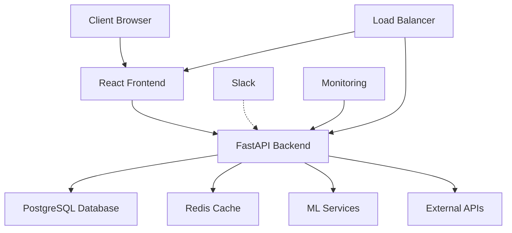

# The Reasoner AI Platform

Welcome to The Reasoner AI Platform documentation! This platform provides a comprehensive solution for AI-powered conversations, project management, and intelligent automation.

## Features

### 🚀 Core Features

- **AI-Powered Conversations**: Engage in intelligent conversations with advanced AI models
- **Project Management**: Organize your work with projects and conversations
- **File Management**: Upload and manage various file types including images, videos, CAD files, and more
- **Real-time Notifications**: Stay updated with in-app, email, and Slack notifications
- **Report Generation**: Generate PDF, Excel, and CSV reports
- **Slack Integration**: Connect your workspace for seamless notifications

### 🔒 Security

- **JWT Authentication**: Secure access with JSON Web Tokens
- **Rate Limiting**: Protection against abuse and DDoS attacks
- **Input Validation**: Comprehensive validation against SQL injection and XSS
- **Security Headers**: Industry-standard security headers
- **Audit Logging**: Complete audit trail of all actions

### 📊 Analytics & Monitoring

- **Performance Metrics**: Track system performance with Prometheus
- **Health Checks**: Monitor system health and component status
- **Load Testing**: Built-in load testing suite with Locust
- **Audit Logs**: Comprehensive logging for security and compliance

### 🛠️ Developer Tools

- **RESTful API**: Well-documented API with OpenAPI/Swagger
- **WebSocket Support**: Real-time communication capabilities
- **Extensible Architecture**: Plugin-based design for easy customization
- **CI/CD Ready**: Docker, Kubernetes, and GitHub Actions support

## Quick Start

### Prerequisites

- Python 3.11+
- Node.js 18+
- PostgreSQL 14+ (or SQLite for development)
- Redis (optional, for caching)

### Installation

```bash
# Clone the repository
git clone https://github.com/reasoner-ai/platform.git
cd platform

# Backend setup
cd backend
python -m venv venv
source venv/bin/activate  # On Windows: venv\Scripts\activate
pip install -r requirements.txt

# Frontend setup
cd ../frontend
npm install

# Start development servers
# Backend
cd backend
uvicorn app.main:app --reload

# Frontend
cd frontend
npm run dev
```

## Architecture



## Documentation Structure

- **[Getting Started](getting-started/quick-start.md)**: Installation and setup guides
- **[User Guide](user-guide/overview.md)**: How to use the platform
- **[API Reference](api/overview.md)**: Complete API documentation
- **[Architecture](architecture/overview.md)**: System design and architecture
- **[Deployment](deployment/overview.md)**: Production deployment guides
- **[Development](development/setup.md)**: Development guidelines
- **[Security](security/overview.md)**: Security best practices

## Support

- **Documentation**: [https://docs.reasoner.ai](https://docs.reasoner.ai)
- **Issues**: [GitHub Issues](https://github.com/reasoner-ai/platform/issues)
- **Discussions**: [GitHub Discussions](https://github.com/reasoner-ai/platform/discussions)
- **Email**: support@reasoner.ai

## License

This project is licensed under the MIT License - see the [LICENSE](LICENSE) file for details.

## Contributing

We welcome contributions! Please see our [Contributing Guide](development/contributing.md) for details.
